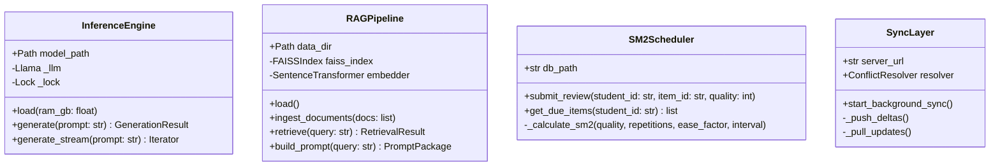
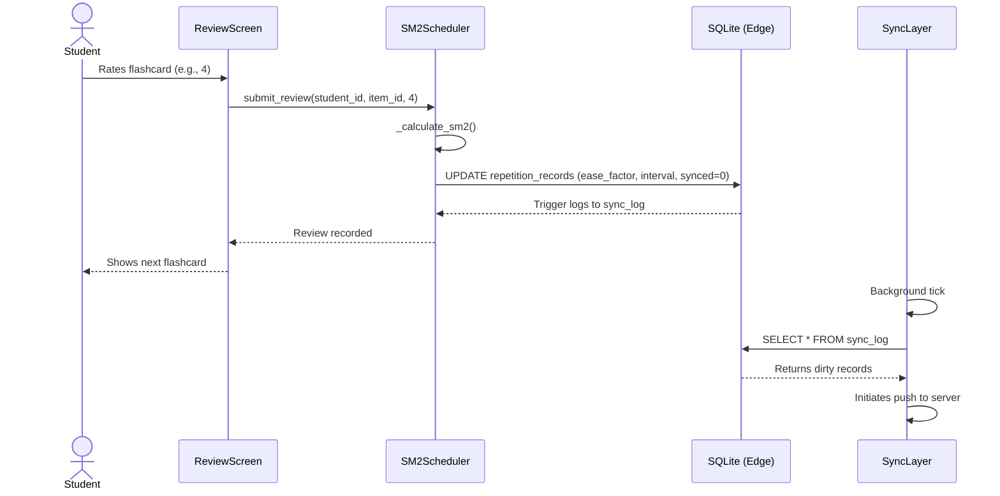
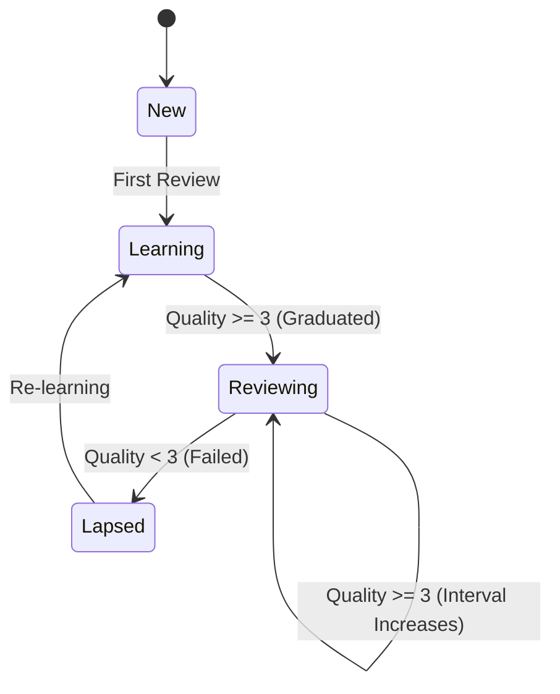
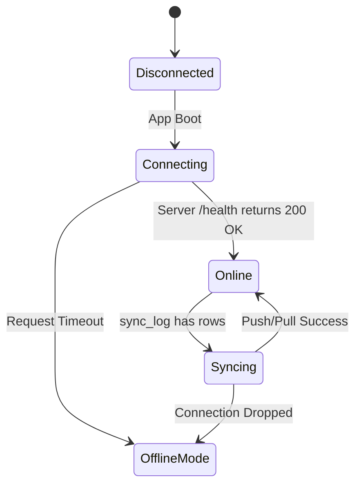
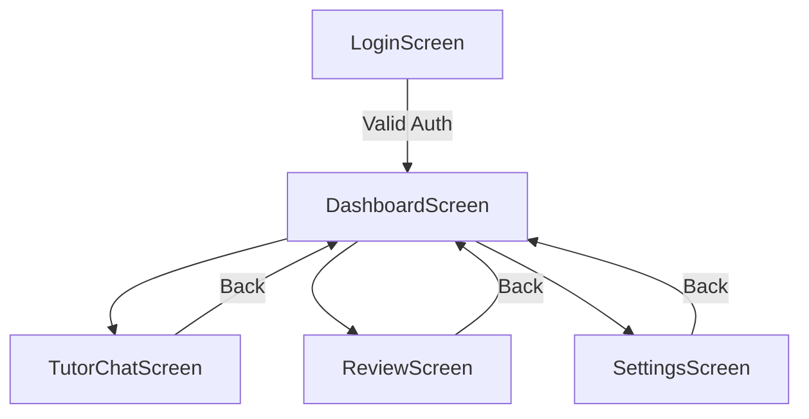

# Engineering Artifacts

This document contains additional architectural models generated during the documentation audit to fully map system behavior.

---

## 1. Class Diagrams

### AI & Synchronization Core (UML)

---

## 2. Sequence Diagrams

### Flashcard Review Flow

---

## 3. State Diagrams

### Flashcard Lifecycle

### User Session Lifecycle

---

## 4. Navigation Diagram

### Application Screen Map

