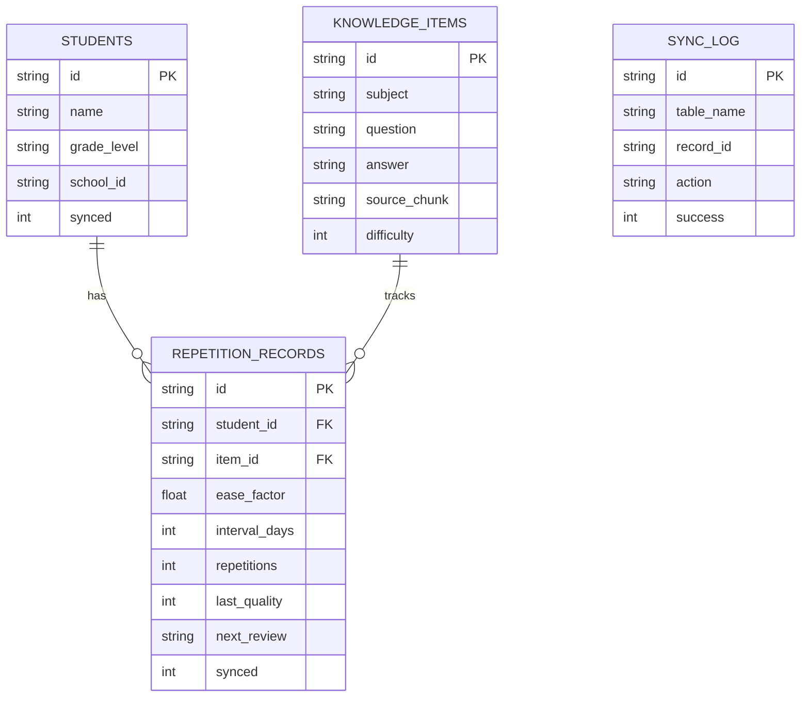
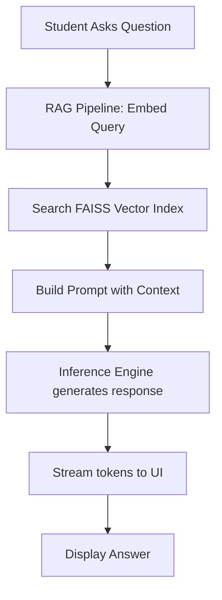
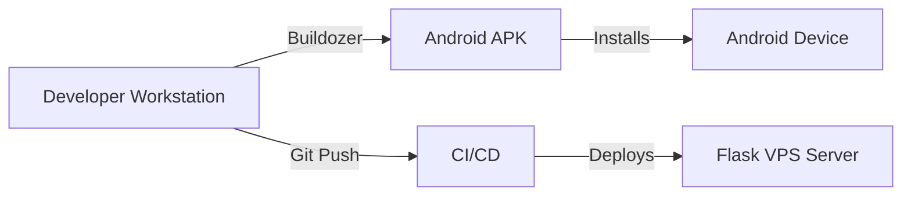

# Technical Project Documentation

## 1. Project Overview

* **Project Title**: Offline-First Android AI Tutoring App
* **Project Objective**: To provide a personalized, offline-first tutoring experience for Nigerian secondary school students using local LLM inference, Retrieval-Augmented Generation (RAG), and a Spaced Repetition System (SM-2).
* **Problem Statement**: Students in areas with poor or expensive internet connectivity lack access to high-quality, personalized educational tools tailored to their local curriculum (NERDC/WAEC).
* **Solution Provided**: A complete Android application that runs a quantized LLM (Phi-3 Mini Q4) and a vector database (FAISS) entirely on-device, enabling interactive tutoring and spaced-repetition flashcards without requiring active internet connectivity. A background delta-sync layer synchronizes progress to a cloud backend when connectivity is available.
* **Scope of Project**: The system encompasses a Kivy-based Android frontend, an offline-first Python backend managing inference and RAG, a local SQLite database for state management and spaced repetition, and a Flask REST API for remote synchronization.

---

## 2. System Architecture

The project utilizes a **Hybrid Component-Based and Offline-First Architecture**. The primary intelligence (LLM and RAG) resides locally on the edge device, adhering to offline-first principles. State synchronization follows an eventual consistency model using Last-Write-Wins (LWW) conflict resolution.

### Architecture Diagram

> [!NOTE]
> **✓ Verified From Code**

```mermaid
graph TD
    subgraph Edge Device (Android)
        UI[Frontend UI - Kivy]
        IE[Inference Engine - llama.cpp]
        RAG[RAG Pipeline - FAISS]
        SM2[SM2 Scheduler]
        LDB[(Local SQLite DB)]
        SyncWorker[Background Sync Layer]
        
        UI --> IE
        UI --> RAG
        UI --> SM2
        SM2 --> LDB
        IE -. reads .-> RAG
    end

    subgraph Cloud Server
        API[Flask REST API]
        CDB[(Server SQLite/PostgreSQL)]
        
        API --> CDB
    end

    SyncWorker -- Delta Push/Pull --> API
```

---

## 3. Technology Stack

| Layer          | Technology | Purpose |
| -------------- | ---------- | ------- |
| **Frontend**   | Kivy & KivyMD | Cross-platform Python UI framework to compile Android APKs. |
| **Edge AI**    | llama-cpp-python | On-device inference of the Phi-3 Mini GGUF model. |
| **Edge RAG**   | FAISS & sentence-transformers | Local vector indexing and semantic similarity search using all-MiniLM-L6-v2. |
| **Backend API**| Flask | Lightweight REST API to handle sync pushes and pulls from devices. |
| **Database**   | SQLite3 | Used on the edge (Android) for offline state and on the server for synced records. |
| **Packaging**  | Buildozer | Compiles the Python Kivy app into a native Android APK. |
| **Testing**    | pytest, unittest.mock | Comprehensive unit and integration testing suite. |

**Why these technologies?**
- **Kivy/Buildozer**: Allows maintaining a unified Python codebase for both the complex AI backend and the mobile frontend.
- **llama.cpp**: Highly optimized C++ inference engine that allows running a 2.1GB quantized model efficiently on ARM architecture (Android) with constrained RAM.
- **SQLite**: Zero-configuration, serverless database ideal for local mobile storage and simple server setups.

---

## 4. Folder Structure Analysis

```text
.
├── backend/
│   ├── corpus_processor.py   # Processes curriculum PDFs into chunks
│   ├── database.py           # SQLite schema and operations
│   ├── inference_engine.py   # llama.cpp wrapper for Phi-3
│   ├── rag_pipeline.py       # FAISS index and semantic search
│   ├── server.py             # Flask sync server
│   ├── sm2_scheduler.py      # SuperMemo 2 algorithm implementation
│   └── sync_layer.py         # Background sync worker and conflict resolver
├── frontend/
│   ├── main.py               # Kivy App entry point
│   ├── screens/              # UI Views (Login, Dashboard, Chat, Review)
│   └── widgets/              # Reusable UI components
├── models/                   # Local GGUF LLM and embedding models
├── data/
│   ├── corpus/               # Raw and processed PDFs/Text
│   ├── faiss_index.index     # Serialized vector database
│   └── tutor.db              # Local SQLite database
├── tests/                    # Pytest test suite covering all logic
├── buildozer.spec            # Android build configuration
└── requirements.txt          # Python dependencies
```

---

## 5. Component Analysis

### 1. `InferenceEngine` (`inference_engine.py`)
* **Purpose**: Manages the loading, execution, and streaming of the Phi-3 LLM.
* **Inputs**: User prompts (augmented with RAG context).
* **Outputs**: Text completions, token usage metrics, latency statistics.
* **Dependencies**: `llama-cpp-python`.
* **Interaction Flow**: Invoked by the UI during chat interactions. It uses hardware presets depending on available RAM (3GB, 4GB, 6GB+).

### 2. `RAGPipeline` (`rag_pipeline.py`)
* **Purpose**: Retrieves context-relevant curriculum chunks to augment LLM prompts.
* **Inputs**: Raw user query, target grade level.
* **Outputs**: Formatted prompt containing the most relevant chunks.
* **Dependencies**: `sentence-transformers`, `faiss`, `jinja2`.
* **Interaction Flow**: Converts queries to vectors using MiniLM, searches the local FAISS FlatIP index, and injects results into a Jinja prompt template.

### 3. `SM2Scheduler` (`sm2_scheduler.py`)
* **Purpose**: Calculates the next review date for flashcards based on user performance.
* **Inputs**: Knowledge item ID, recall quality score (0-5).
* **Outputs**: Updated ease factor, new interval, and next review date.
* **Dependencies**: `sqlite3`.
* **Interaction Flow**: Updates the local SQLite database via triggers. Flags updated rows with `synced=0` for the SyncLayer.

### 4. `SyncLayer` (`sync_layer.py`)
* **Purpose**: Ensures offline-first continuity by synchronizing local SQLite state to the cloud when internet is available.
* **Inputs**: Dirty local records (`synced=0`), remote records.
* **Outputs**: Synchronized local database, resolved conflicts.
* **Dependencies**: Standard library `urllib`, threading.
* **Interaction Flow**: Runs in a background daemon thread, polls the Flask `/health` endpoint, pushes dirty records, pulls remote records since the last sync, and applies a Last-Write-Wins conflict resolution.

---

## 6. Database Design

### ER Diagram

> [!NOTE]
> **✓ Verified From Code**



---

## 7. Authentication & Authorization

Currently, the system is designed for individual, offline-first device usage. A simplified authentication model is utilized:
* **Login Flow**: Users input their profile details locally. The app registers them in the local `students` table.
* **Session Management**: Handled locally via SQLite. The `student_id` acts as the primary key for all local and synced records.
* **Authorization**: The Flask server currently utilizes the `student_id` passed in payload requests to segment data. 

> [!WARNING]
> **Missing Implementation**: The `/api/v1/sync` endpoints currently lack JWT or OAuth authentication. Any client can push data if the `student_id` is known. This is documented in the Technical Debt Report.

---

## 8. API Documentation

The Flask Server (`server.py`) provides the following endpoints for the SyncLayer:

| Endpoint | Method | Purpose |
| -------- | ------ | ------- |
| `/health` | GET | Connectivity check for Android clients. |
| `/query` | POST | Fallback cloud inference engine (streams JSON-L). |
| `/api/v1/sync/push` | POST | Accepts delta records from a client. |
| `/api/v1/sync/pull` | GET | Returns records updated since a specific timestamp. |

### Push Endpoint Details
* **Request Format**: `{"student_id": "stu_001", "records": [{...}], "client_timestamp": "2024-01-01T..."}`
* **Response Format**: `{"accepted_ids": [...], "rejected_ids": [...], "server_timestamp": "..."}`
* **Conflict Handling**: The server uses a Last-Write-Wins strategy based on `updated_at`.

---

## 9. Business Logic Flow

The core system flow involves answering a student query using the local curriculum.

### Activity Diagram



---

## 10. User Workflow

1. **Initialization**: Student opens the app. Background `SyncLayer` checks for connectivity.
2. **Review Session**: Student navigates to the Review screen. `SM2Scheduler` pulls items due today (`next_review <= today`).
3. **Rating**: Student answers a flashcard and rates their recall (0-5).
4. **Database Trigger**: SQLite trigger updates `ease_factor` and marks `synced=0`.
5. **Background Sync**: `SyncLayer` thread detects `synced=0`, pushes the delta to the Flask API, and updates local state to `synced=1`.

---

## 11. Security Implementation

* **Data Protection**: All sensitive learning data and ML models exist primarily on the local device, ensuring absolute data privacy.
* **API Security**: Cloud synchronization relies on `student_id` segmentation.
* **Input Validation**: SQLite parameterized queries (`?` bind variables) are used rigorously across `server.py` and `sm2_scheduler.py` to prevent SQL Injection.

---

## 12. Performance Considerations

* **Local LLM Inference**: Generates <3s per query on mid-range devices by using highly-quantized models (Q4_K_M) via `llama.cpp`.
* **RAM Management**: The `InferenceEngine` utilizes dynamic hardware presets based on available RAM to adjust context windows and threading.
* **Delta Synchronization**: The SyncLayer strictly uses delta-syncs (transferring only modified `repetition_records`) rather than full database snapshots, minimizing bandwidth consumption on constrained mobile networks.

---

## 13. Deployment Architecture



* **Frontend Build**: Built using Kivy and packaged into a native `.apk` using `buildozer android debug`.
* **Backend Hosting**: The Flask synchronization server is designed to be lightweight, deployable on standard VPS providers.

---

## 14. Challenges Solved

* **Challenge**: Running large language models on restricted mobile hardware.
  * **Solution**: Switched from heavy PyTorch inferences to `llama-cpp-python` with a 4-bit quantized Phi-3 model (2.1GB), allowing it to fit into 3GB-4GB RAM profiles.
* **Challenge**: Database conflicts when a user learns offline on multiple devices.
  * **Solution**: Implemented a Last-Write-Wins (LWW) conflict resolver (`ConflictResolver` in `sync_layer.py`) utilizing timestamp tie-breaking and repetition-count verification.

---

## 15. Future Improvements

1. Migration from Flask to FastAPI for asynchronous HTTP handling.
2. Introduction of JWT-based authentication for the Sync API.
3. Cloud-based model fine-tuning utilizing anonymized student performance metrics.

---

## 16. Conclusion

The Offline-First Android AI Tutoring App successfully demonstrates the viability of executing modern generative AI and retrieval-augmented pipelines entirely on edge devices. By shifting computation to the client and utilizing an eventual-consistency sync model, the system circumvents internet infrastructure limitations while providing a resilient, highly personalized educational experience.
